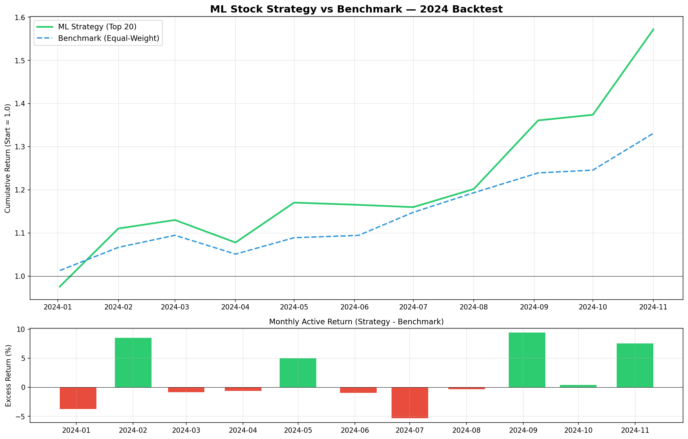

# S&P 500 ML Equity Research Platform

End-to-end machine learning system that ranks S&P 500 stocks on predicted 1-month forward performance, with a backtested investment strategy and interactive dashboard.

**🔗 Live Demo:** https://equity-research-ml-jwmnosnrbegtpmvwe66xyn.streamlit.app

---

## Results

A monthly-rebalanced strategy holding the top 20 stocks by model score, backtested on out-of-sample 2024 data:

| Metric | Strategy | Benchmark (Equal-Weight) |
|---|---|---|
| Total Return | +57.2% | +33.1% |
| Annualized Return | +67.7% | +37.2% |
| Sharpe Ratio | 2.96 | 3.79 |
| Max Drawdown | -4.6% | -4.0% |
| Annualized Alpha | +30.5% | — |



> The strategy generated significant alpha but with higher concentration risk (20 stocks vs 500). The benchmark's higher Sharpe reflects its better risk-adjusted efficiency. Results should be validated across multiple market regimes before live deployment.

---

## Methodology

### Data
- 5 years of daily OHLCV data for ~480 S&P 500 constituents (Yahoo Finance via `yfinance`)
- ~600,000 ticker-day observations after feature engineering

### Features (13 total)
- **Returns:** 1-day, 5-day, 1-month, 3-month, 12-month
- **Moving averages:** 20/50/200-day SMAs and price relative to each
- **Volatility:** 21-day and 63-day annualized
- **Technical indicators:** RSI (14), Bollinger Band position
- **Volume:** 20-day relative volume ratio

### Target
Binary classification: is this stock in the **top 20%** of forward 21-day returns *for its date*? Cross-sectional ranking prevents regime bias.

### Models
- **Baseline:** Logistic Regression
- **Final:** XGBoost (Test AUC: 0.60)

### Backtest
- Train: 2020-01 to 2023-12
- Test: 2024-01 to 2024-11
- Monthly rebalance, equal-weight top 20 by model score

---

## Top Predictive Features

The model independently identified three well-documented academic anomalies as its top predictors:

1. **63-day volatility** — the low-volatility anomaly (Frazzini & Pedersen 2014)
2. **12-month return** — momentum (Jegadeesh & Titman 1993)
3. **Price vs 200-day MA** — long-term trend following

---

## Limitations & Future Work

- No transaction costs in backtest (realistically -1 to -3% annualized)
- Single-year out-of-sample window — needs walk-forward testing across multiple regimes
- Concentration risk in 20-stock portfolio not penalized in objective function
- Could improve with: fundamental features (P/E, earnings revisions), sector neutralization, hyperparameter tuning, factor exposure constraints

---

## Tech Stack

`Python 3.13` · `pandas` · `numpy` · `scikit-learn` · `XGBoost` · `Streamlit` · `Matplotlib` · `yfinance`

---

## Project Structure


---

## Running Locally

```bash
git clone https://github.com/brycekropczynski/equity-research.git
cd equity-research
python3 -m venv venv
source venv/bin/activate
pip install -r requirements.txt
python src/get_tickers.py
python src/download_prices.py
python src/build_features.py
python src/build_target.py
python src/train_test_split.py
python src/train_xgboost.py
python src/backtest.py
streamlit run app/streamlit_app.py
```

---

*Built by Bryce Kropczynski as a portfolio project demonstrating the application of machine learning techniques to systematic equity selection.*